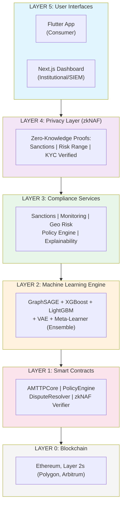
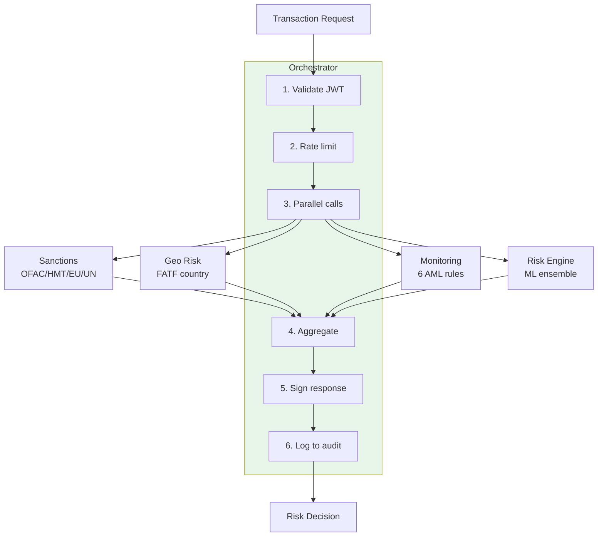
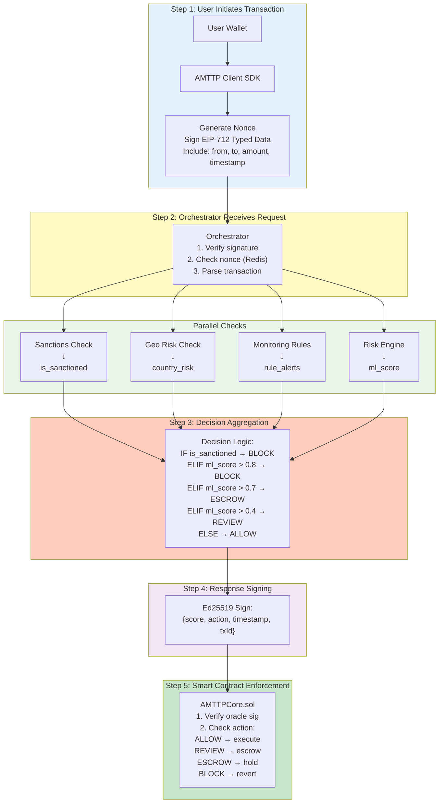
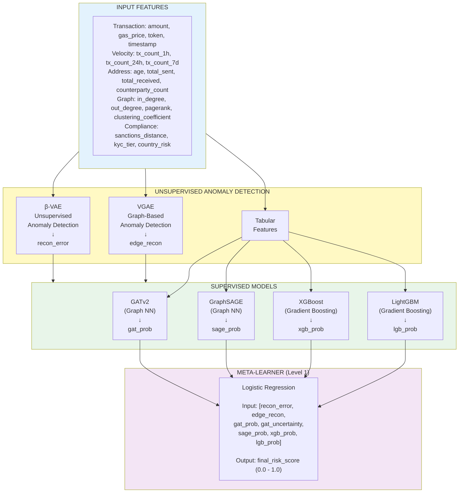
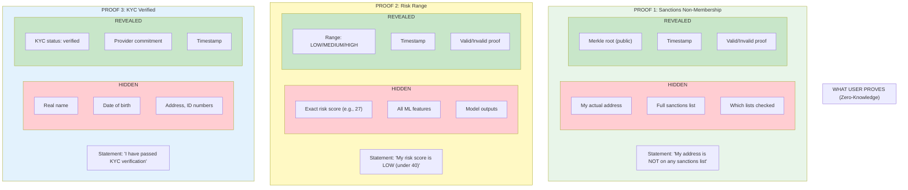

```mermaid
flowchart TB
    subgraph Users["END USERS"]
        Flutter["Flutter Consumer App<br/>Port 3010<br/>• Wallet connection<br/>• Transfer/Send<br/>• zkNAF Proofs"]
        NextJS["Next.js War Room<br/>Port 3006<br/>• SIEM Dashboard<br/>• Compliance Reports<br/>• Alert Management"]
    end
    
    subgraph Gateway["NGINX GATEWAY (Port 80)"]
        NGINX["TLS termination | Rate limiting<br/>JWT validation | Cloudflare DDoS"]
    end
    
    subgraph Oracle["AMTTP ORACLE SERVICES"]
        Orchestrator["ORCHESTRATOR<br/>(8007)<br/>API Gateway<br/>Profile Mgmt<br/>Decision Flow"]
        Risk["RISK ENGINE<br/>(8000)<br/>ML Ensemble<br/>Graph ML<br/>XGBoost"]
        Sanctions["SANCTIONS<br/>(8004)<br/>OFAC | HMT<br/>EU | UN Lists"]
        Monitoring["MONITORING<br/>(8005)<br/>6 AML Rules<br/>Alert Mgmt<br/>SAR Triggers"]
        GeoRisk["GEO RISK<br/>(8006)<br/>FATF Lists<br/>Country Risk<br/>Black/Grey"]
        Integrity["INTEGRITY<br/>(8008)<br/>UI Tampering<br/>Hash Verify<br/>Audit Trail"]
        Explainability["EXPLAINABILITY<br/>(8009)<br/>Human-Readable<br/>Typology Match"]
        zkNAF["zkNAF<br/>(8003)<br/>ZK Proofs<br/>Privacy"]
    end
    
    subgraph Data["DATA INFRASTRUCTURE"]
        MongoDB["MongoDB<br/>(27017)<br/>User data, Tx logs"]
        Redis["Redis<br/>(6379)<br/>Session, Cache"]
        Memgraph["Memgraph<br/>(7687)<br/>Graph DB, PageRank"]
        MinIO["MinIO<br/>(9000)<br/>ML Models"]
        IPFS["IPFS (Helia)<br/>Immutable Audit Logs"]
    end
    
    subgraph Blockchain["BLOCKCHAIN LAYER"]
        Core["AMTTPCore.sol<br/>secureTransfer<br/>Escrow Logic"]
        Policy["PolicyEngine.sol<br/>Risk Thresholds<br/>User Policies"]
        zkNAFContract["AMTTPzkNAF.sol<br/>ZK Verifier<br/>Proof Storage"]
        Networks["Ethereum | Polygon | Arbitrum"]
    end
    
    Users --> Gateway
    Gateway --> Oracle
    Orchestrator <--> Risk
    Orchestrator --> Sanctions
    Orchestrator --> Monitoring
    Orchestrator --> GeoRisk
    Orchestrator --> Integrity
    Orchestrator --> Explainability
    Orchestrator --> zkNAF
    Oracle --> Data
    Data --> Blockchain
    
    style Users fill:#e3f2fd
    style Gateway fill:#fff9c4
    style Oracle fill:#e8f5e9
    style Data fill:#fce4ec
    style Blockchain fill:#f3e5f5
```

# AMTTP: Anti-Money Laundering Transaction Trust Protocol

## Complete Technical & Regulatory Documentation

**Version:** 1.0  
**Date:** February 2026  
**Classification:** Technical Documentation / Investor/Partner Reference  
**Audience:** External stakeholders, regulators, auditors, technical evaluators

---

## Table of Contents

1. [Executive Summary](#1-executive-summary)
2. [Problem Statement](#2-problem-statement)
3. [Solution Overview](#3-solution-overview)
4. [System Architecture](#4-system-architecture)
5. [Component Deep Dive](#5-component-deep-dive)
6. [Information Flow](#6-information-flow)
7. [Machine Learning Pipeline](#7-machine-learning-pipeline)
8. [Zero-Knowledge Privacy Layer (zkNAF)](#8-zero-knowledge-privacy-layer-zknaf)
9. [Smart Contract Layer](#9-smart-contract-layer)
10. [Client SDK](#10-client-sdk)
11. [REST API Reference](#11-rest-api-reference)
12. [UK & EU Regulatory Compliance](#12-uk--eu-regulatory-compliance)
13. [Security Architecture](#13-security-architecture)
14. [Deployment Architecture](#14-deployment-architecture)
15. [References](#15-references)

---

## 1. Executive Summary

**AMTTP (Anti-Money Laundering Transaction Trust Protocol)** is a comprehensive DeFi compliance platform that embeds regulatory compliance directly into blockchain transaction flows. Unlike traditional post-hoc monitoring solutions, AMTTP provides:

- **Pre-transaction risk assessment** using a state-of-the-art ML ensemble
- **Real-time sanctions screening** against OFAC, HMT, EU, and UN lists
- **Privacy-preserving compliance proofs** using zero-knowledge cryptography
- **On-chain enforcement** via smart contracts that automatically block high-risk transactions
- **Full regulatory compliance** with UK FCA MLR 2017, EU AMLD5/6, and FATF recommendations

### Key Differentiators

| Feature | Traditional AML | AMTTP |
|---------|-----------------|-------|
| **Integration Point** | Post-transaction monitoring | Pre-transaction enforcement |
| **Response Time** | Hours to days | < 50ms real-time |
| **Enforcement** | Manual intervention | Automatic smart contract blocking |
| **Privacy** | Full data exposure | Zero-knowledge proofs available |
| **Explainability** | Black-box scores | Human-readable explanations |

---

## 2. Problem Statement

### The DeFi Compliance Gap

Decentralized Finance (DeFi) protocols face a critical regulatory challenge:

1. **No Central Authority**: Unlike banks, DeFi protocols cannot identify users or block transactions
2. **Pseudonymous Transactions**: Blockchain addresses reveal no real-world identity
3. **Cross-Border by Default**: Any user anywhere can interact with any protocol
4. **Speed of Transactions**: Settlement in seconds vs. days for traditional finance

### Regulatory Pressure

Financial regulators globally are demanding DeFi compliance:

| Jurisdiction | Regulation | Requirement |
|--------------|------------|-------------|
| **UK** | MLR 2017, FSMA s.330 | Customer due diligence, SAR reporting |
| **EU** | AMLD5/6, TFR | Travel Rule, sanctions screening |
| **US** | BSA, OFAC | Sanctions compliance, AML programs |
| **Global** | FATF Recommendations | Risk-based approach, Travel Rule |

### Consequences of Non-Compliance

- **Tornado Cash Sanctions (2022)**: OFAC sanctioned entire protocol, users prosecuted
- **FTX Collapse (2022)**: Lack of controls enabled massive fraud
- **Bybit UI Attack (2024)**: Attackers manipulated UI to steal via legitimate transactions
- **Regulatory Enforcement**: Increasing fines and criminal prosecutions

---

## 3. Solution Overview

AMTTP solves these problems through a **layered compliance architecture**:

> **Diagram Rendering:** Copy the Mermaid code below to [mermaid.live](https://mermaid.live) to generate a visual diagram, then paste as an image.



### How It Works

1. **User initiates transaction** via wallet or AMTTP app
2. **Client SDK** captures transaction details and signs request
3. **AMTTP Oracle** scores transaction risk in < 50ms using ML ensemble
4. **Smart Contract** receives signed risk score and enforces policy:
   - Score < 0.4: **ALLOW** - Transaction proceeds
   - Score 0.4-0.7: **REVIEW** - Held for analyst review
   - Score 0.7-0.8: **ESCROW** - Funds held pending investigation
   - Score > 0.8: **BLOCK** - Transaction rejected, SAR filed
5. **Audit trail** written to immutable storage (IPFS)

---

## 4. System Architecture

### High-Level Architecture Diagram

> **Diagram Rendering:** Copy the Mermaid code below to [mermaid.live](https://mermaid.live) to generate a visual diagram, then paste as an image.



---

## 5. Component Deep Dive

### 5.1 Flutter Consumer Application

**Purpose:** Primary end-user interface for wallet management, transfers, and compliance proofs.

**Key Features:**
| Feature | Description | Problem Solved |
|---------|-------------|----------------|
| **Wallet Connection** | MetaMask, WalletConnect integration | Secure user authentication without passwords |
| **Transfer/Send** | Risk-checked transaction submission | Pre-transaction compliance verification |
| **Trust Check Interstitial** | Visual risk indicator before confirmation | User awareness of transaction risk |
| **zkNAF Proofs** | Generate privacy-preserving compliance proofs | Users can prove compliance without revealing identity |

**Technology:**
- Flutter 3.24 (cross-platform: iOS, Android, Web, Windows, macOS, Linux)
- WalletConnect v2 for Web3 connectivity
- State management: Provider pattern

### 5.2 Next.js War Room Dashboard

**Purpose:** Institutional compliance dashboard for analysts, compliance officers, and administrators.

**Key Features:**
| Feature | Description | Problem Solved |
|---------|-------------|----------------|
| **SIEM Dashboard** | Real-time threat monitoring | Security Operations Center (SOC) visibility |
| **Compliance Reports** | FATF Travel Rule, SAR management | Regulatory reporting automation |
| **Graph Explorer** | Visual transaction network analysis | Money laundering pattern detection |
| **Velocity Heatmap** | Transaction velocity visualization | Structuring/smurfing detection |
| **Role Management** | 6-tier RBAC system | Access control for different user types |

**Role Hierarchy:**
```
super_admin          ← Full system access
    ↓
institution_admin    ← Organization management
    ↓
compliance_officer   ← SAR filing, case management
    ↓
analyst              ← Alert investigation
    ↓
auditor              ← Read-only compliance view
    ↓
viewer               ← Basic dashboard access
```

### 5.3 Orchestrator Service (Port 8007)

**Purpose:** Central API gateway that coordinates all compliance checks for each transaction.

**Flow:**



### 5.4 Risk Engine (Port 8000)

**Purpose:** ML-powered fraud detection using a stacked ensemble architecture.

**Ensemble Components:**
| Model | Type | Strength | Output |
|-------|------|----------|--------|
| **β-VAE** | Unsupervised | Anomaly detection (novel patterns) | recon_error |
| **VGAE** | Graph Unsupervised | Graph structure anomalies | edge_recon_score |
| **GATv2** | Graph Supervised | Local neighborhood patterns | gat_prob |
| **GraphSAGE** | Graph Supervised | Multi-hop propagation | sage_prob |
| **XGBoost** | Tabular | Feature interactions | xgb_prob |
| **LightGBM** | Tabular | Ensemble diversity | lgb_prob |
| **Meta-Learner** | Ensemble | Model combination | final_score |

**Performance (Validated):**
- ROC-AUC: ~0.94
- Precision @ Block threshold: ~91%
- Latency: < 50ms (P99 target)

### 5.5 Sanctions Service (Port 8004)

**Purpose:** Real-time screening against global sanctions lists.

**Lists Checked:**
| List | Source | Update Frequency |
|------|--------|------------------|
| **OFAC SDN** | US Treasury | Real-time |
| **HMT** | UK HM Treasury | Real-time |
| **EU Consolidated** | European Commission | Daily |
| **UN Security Council** | United Nations | Daily |

**API Example:**
```json
POST /sanctions/check
{
  "address": "0x8576acc5c05d6ce88f4e49bf65bdf0c62f91353c"
}

Response:
{
  "is_sanctioned": true,
  "matches": [{
    "list": "OFAC",
    "entity": "Tornado Cash",
    "match_type": "exact_address",
    "confidence": 1.0
  }]
}
```

### 5.6 Monitoring Service (Port 8005)

**Purpose:** Rule-based detection for common AML typologies.

**6 AML Rules:**
| Rule | Detection | Threshold |
|------|-----------|-----------|
| **Large Transaction** | Single tx exceeding limit | > 10,000 ETH equivalent |
| **Rapid Succession** | Burst of transactions | > 5 tx in 10 minutes |
| **Structuring** | Near-threshold amounts | Multiple tx just below reporting limit |
| **Mixer Interaction** | Known mixer addresses | Any interaction with Tornado Cash, etc. |
| **Dormant Activation** | Long inactive then active | > 180 days dormancy |
| **High-Risk Geography** | FATF blacklisted countries | Transaction to/from sanctioned jurisdictions |

### 5.7 Explainability Service (Port 8009)

**Purpose:** Generate human-readable explanations for ML decisions.

**Why This Matters:**
Regulators (FCA, ESMA) increasingly require explainability for AI-based decisions. Raw ML scores are not acceptable for SAR filings or customer dispute resolution.

**Example Output:**
```json
{
  "risk_score": 0.73,
  "action": "ESCROW",
  "summary": "Transaction held - layering pattern detected",
  "top_reasons": [
    "Transaction amount ($847K) is 12x larger than sender's 30-day average",
    "Recipient has received funds from sanctioned addresses (2 hops)",
    "Account was dormant for 190 days before this activity"
  ],
  "typology_matches": [
    {"typology": "layering", "confidence": 0.85}
  ],
  "recommendations": [
    "Trace full transaction chain origin",
    "Request additional KYC documentation"
  ],
  "regulatory_justification": "Under MLR 2017 Regulation 28, enhanced due diligence is required..."
}
```

### 5.8 Integrity Service (Port 8008)

**Purpose:** Prevent UI manipulation attacks (like the Bybit incident).

**Problem Solved:**
In the Bybit hack (2024), attackers manipulated the user interface to show different transaction details than what was actually signed. Users approved legitimate-looking transactions that actually sent funds to attackers.

**How It Works:**
1. **Server-side hash** of expected transaction details stored
2. **Client-side verification** before user approval
3. **Hash comparison** ensures UI matches server state
4. **Mismatch = Block** with user warning

---

## 6. Information Flow

### 6.1 Transaction Scoring Flow

> **Diagram Rendering:** Copy the Mermaid code below to [mermaid.live](https://mermaid.live) to generate a visual diagram, then paste as an image.



### 6.2 Data Flow Summary

| Stage | Data | Source | Destination | Purpose |
|-------|------|--------|-------------|---------|
| 1 | Transaction details | User wallet | Client SDK | Capture intent |
| 2 | Signed request | Client SDK | Orchestrator | Authentication |
| 3 | Address lookup | Orchestrator | Sanctions DB | Sanctions check |
| 4 | Country code | Orchestrator | Geo Risk DB | FATF compliance |
| 5 | Historical txs | Orchestrator | Monitoring | Rule evaluation |
| 6 | Features | Orchestrator | Risk Engine | ML scoring |
| 7 | Graph data | Risk Engine | Memgraph | Graph analysis |
| 8 | Embeddings | Risk Engine | Redis | Cached features |
| 9 | Final score | Risk Engine | Orchestrator | Decision |
| 10 | Signed decision | Orchestrator | Smart Contract | Enforcement |
| 11 | Audit log | All services | IPFS | Immutable record |

---

## 7. Machine Learning Pipeline

### 7.1 Overview

AMTTP uses a **stacked ensemble** of 7 models trained on Ethereum transaction data:

> **Diagram Rendering:** Copy the Mermaid code below to [mermaid.live](https://mermaid.live) to generate a visual diagram, then paste as an image.



### 7.2 Model Purpose & Strengths

| Model | What It Detects | Why Included |
|-------|-----------------|--------------|
| **β-VAE** | Novel/unusual transaction patterns | Catches zero-day fraud not in training data |
| **VGAE** | Anomalous graph structures | Detects unnatural network formations |
| **GATv2** | Local neighborhood risks | Identifies guilt-by-association |
| **GraphSAGE** | Multi-hop money flows | Traces layering across many hops |
| **XGBoost** | Complex feature interactions | Primary workhorse, most accurate single model |
| **LightGBM** | Diverse gradient boosting | Ensemble diversity, prevents overfitting |
| **Meta-Learner** | Model disagreement | Combines all signals, calibrated probability |

### 7.3 Training Pipeline

**Two-Notebook System:**

1. **Notebook 1: Hope_machine** - Pseudo-label generation
   - Trains baseline XGBoost on labeled Kaggle fraud data
   - Applies to unlabeled Ethereum data with high confidence (>85%)
   - Creates weak labels for unsupervised training

2. **Notebook 2: vae_gnn_pipeline** - Full production pipeline
   - 10-step training process
   - Strict temporal split (no leakage)
   - Address holdout to prevent memorization

### 7.4 Validation Metrics

| Metric | Value | Significance |
|--------|-------|--------------|
| **ROC-AUC** | ~0.94 | Excellent discrimination |
| **PR-AUC** | ~0.87 | Good precision-recall balance |
| **Precision @ Block** | ~91% | 9% false positive rate at high-risk |
| **Recall @ Block** | ~73% | Catches 73% of fraud at Block threshold |
| **Calibration (ECE)** | <0.05 | Well-calibrated probabilities |

---

## 8. Zero-Knowledge Privacy Layer (zkNAF)

### 8.1 Overview

**zkNAF (Zero-Knowledge Non-Disclosing Anti-Fraud)** allows users to prove compliance *without revealing private information*.

### 8.2 The Privacy Problem

Traditional compliance requires exposing sensitive data:
- Full name and date of birth (KYC)
- Exact risk score and ML features
- All addresses checked against sanctions lists

This creates:
- **Privacy risks** - Data breaches expose user identity
- **Centralization** - All data flows through compliance provider
- **Surveillance concerns** - DeFi loses censorship resistance

### 8.3 zkNAF Solution

Users generate **zero-knowledge proofs** that prove compliance statements without revealing underlying data:

> **Diagram Rendering:** Copy the Mermaid code below to [mermaid.live](https://mermaid.live) to generate a visual diagram, then paste as an image.



**Summary Table:**

| Proof Type | Statement | Hidden Data | Revealed Data |
|------------|-----------|-------------|---------------|
| **Sanctions** | "Not on any sanctions list" | Address, full list, which lists | Merkle root, timestamp, validity |
| **Risk Range** | "Risk score is LOW" | Exact score, ML features, outputs | Range (LOW/MED/HIGH), timestamp |
| **KYC Verified** | "Passed KYC verification" | Name, DOB, ID numbers | Status, provider commitment |

### 8.4 Technical Implementation

**Technology:** Groth16 zero-knowledge proofs on BN254 elliptic curve

**Circuits (Circom):**
| Circuit | Purpose | Constraints |
|---------|---------|-------------|
| `sanctions_non_membership.circom` | Prove not on sanctions list | ~50,000 |
| `risk_range_proof.circom` | Prove risk is within range | ~10,000 |
| `kyc_credential.circom` | Prove KYC verified status | ~15,000 |

**On-Chain Verification:**
```solidity
// AMTTPzkNAF.sol
function verifyAndStore(
    ProofType proofType,    // SANCTIONS, RISK, KYC
    Proof calldata proof,   // Groth16 proof
    uint256[] calldata publicInputs
) external returns (bytes32 proofHash);
```

### 8.5 FCA Compliance Compatibility

zkNAF does **NOT** replace regulatory obligations:

| Requirement | How AMTTP Complies |
|-------------|---------------------|
| **Customer Due Diligence** | Full KYC records maintained by AMTTP (not on chain) |
| **Ongoing Monitoring** | Full risk scores stored internally |
| **SAR Filing** | Underlying data available for SAR submission |
| **Law Enforcement** | Full records produced on legal request |
| **5-Year Retention** | All data retained per MLR 2017 |

zkNAF proofs are **supplementary** - they allow users to interact with DeFi privately while AMTTP maintains full regulatory records.

---

## 9. Smart Contract Layer

### 9.1 Contract Overview

| Contract | Purpose | Key Functions |
|----------|---------|---------------|
| **AMTTPCore.sol** | Main transfer logic | `secureTransfer()`, `initiateSwap()`, `completeSwap()` |
| **AMTTPPolicyEngine.sol** | Risk thresholds, policies | `updatePolicy()`, `setThreshold()`, `pause()` |
| **AMTTPDisputeResolver.sol** | Kleros arbitration | `createDispute()`, `submitEvidence()`, `executeRuling()` |
| **AMTTPzkNAF.sol** | ZK proof verification | `verifyAndStore()`, `isCompliant()` |
| **AMTTPNFT.sol** | Compliance certificates | `mint()`, `verify()` |

### 9.2 Secure Transfer Flow

```solidity
// User calls secureTransfer
function secureTransfer(
    address to,
    uint256 amount,
    bytes calldata oracleSignature,
    uint256 riskScore,
    uint256 timestamp
) external payable {
    // 1. Verify oracle signature
    require(_verifyOracleSignature(
        msg.sender, to, amount, riskScore, timestamp, oracleSignature
    ), "Invalid signature");
    
    // 2. Check timestamp freshness (< 5 minutes)
    require(block.timestamp - timestamp < 300, "Stale score");
    
    // 3. Get action based on risk score and policy
    Action action = policyEngine.getAction(msg.sender, riskScore);
    
    // 4. Execute based on action
    if (action == Action.ALLOW) {
        // Direct transfer
        (bool success,) = to.call{value: amount}("");
        require(success, "Transfer failed");
    } else if (action == Action.REVIEW || action == Action.ESCROW) {
        // Create escrow
        _createEscrow(msg.sender, to, amount, action);
    } else {
        // BLOCK
        revert("Transaction blocked");
    }
}
```

### 9.3 Policy Engine

The PolicyEngine allows configurable risk thresholds:

```solidity
// Default thresholds
uint256 public allowThreshold = 4000;   // 0.40 = ALLOW
uint256 public reviewThreshold = 7000;  // 0.70 = REVIEW/ESCROW
uint256 public blockThreshold = 8000;   // 0.80 = BLOCK

// Per-user overrides (e.g., for whitelisted institutions)
mapping(address => UserPolicy) public userPolicies;
```

### 9.4 Escrow & Disputes

For REVIEW/ESCROW transactions:

1. **Funds held** in escrow contract
2. **Analyst reviews** within timelock period (default: 48 hours)
3. **Resolution:**
   - Approved → Funds released to recipient
   - Rejected → Funds returned to sender
   - Disputed → Escalate to Kleros arbitration

**Kleros Integration:**
- Decentralized dispute resolution
- IArbitrable interface implementation
- Evidence submission on-chain (IPFS links)

---

## 10. Client SDK

### 10.1 Overview

AMTTP provides a comprehensive **TypeScript SDK** (`@amttp/client-sdk`) for integrating compliance features into applications. The SDK abstracts all backend services into a single, type-safe interface.

**Installation:**
```bash
npm install @amttp/client-sdk
# or
yarn add @amttp/client-sdk
# or
pnpm add @amttp/client-sdk
```

**Quick Start:**
```typescript
import { AMTTPClient } from '@amttp/client-sdk';

const client = new AMTTPClient({
  baseUrl: 'https://api.amttp.io',
  apiKey: 'your-api-key',
  timeout: 30000,
});

// Assess risk for an address
const risk = await client.risk.assess({
  address: '0x1234567890abcdef...',
  amount: '1000000000000000000', // 1 ETH in wei
});

console.log(`Risk Score: ${risk.riskScore}, Level: ${risk.riskLevel}`);
```

### 10.2 SDK Services

The SDK provides **22 specialized services**:

| Service | Purpose | Key Methods |
|---------|---------|-------------|
| **risk** | ML risk scoring | `assess()`, `batchAssess()`, `getHistory()` |
| **kyc** | KYC verification | `submit()`, `getStatus()`, `uploadDocument()` |
| **transactions** | Transaction management | `validate()`, `submit()`, `getHistory()` |
| **policy** | Policy evaluation | `evaluate()`, `create()`, `test()` |
| **disputes** | Kleros arbitration | `create()`, `submitEvidence()`, `escalateToKleros()` |
| **reputation** | 5-tier reputation | `getProfile()`, `getBadges()`, `calculateImpact()` |
| **bulk** | Batch operations (10K) | `submit()`, `getStatus()`, `getResults()` |
| **webhooks** | Event notifications | `create()`, `test()`, `verifySignature()` |
| **pep** | PEP screening | `screen()`, `batchScreen()`, `acknowledgeMatch()` |
| **edd** | Enhanced Due Diligence | `create()`, `assign()`, `resolve()` |
| **monitoring** | Ongoing monitoring | `addAddress()`, `createRule()`, `getAlerts()` |
| **labels** | Address categorization | `getLabels()`, `hasLabels()`, `addLabel()` |
| **mev** | MEV protection | `analyze()`, `submitProtected()` |
| **compliance** | Unified compliance | `evaluate()`, `getProfile()`, `updateProfile()` |
| **explainability** | ML explanations | `explain()`, `explainTransaction()`, `getTypologies()` |
| **sanctions** | OFAC/EU/UN screening | `check()`, `batchCheck()`, `getStats()` |
| **geographic** | FATF country risk | `getCountryRisk()`, `getIpRisk()`, `getFatfBlackList()` |
| **integrity** | UI tampering detection | `registerHash()`, `verifyIntegrity()`, `submitPayment()` |
| **governance** | Multi-sig enforcement | `createAction()`, `signAction()`, `executeAction()` |
| **profile** | Entity profiles | `get()`, `update()`, `getDecisions()` |
| **dashboard** | Analytics | `getStats()`, `getTrends()`, `getAlerts()` |

### 10.3 Key SDK Features

#### Risk Assessment

```typescript
// Single address assessment with ML ensemble
const risk = await client.risk.assess({
  address: '0x...',
  transactionHash: '0x...',
  amount: '1000000000000000000',
  counterparty: '0x...',
});

// Response includes ML score + confidence
console.log(`Score: ${risk.riskScore}`);     // 0.0 - 1.0
console.log(`Level: ${risk.riskLevel}`);     // low, medium, high, critical
console.log(`Action: ${risk.action}`);       // ALLOW, REVIEW, ESCROW, BLOCK
console.log(`Confidence: ${risk.confidenceInterval}`);
```

#### Transaction Validation

```typescript
// Validate before submission
const validation = await client.transactions.validate({
  from: '0x...',
  to: '0x...',
  amount: '1000000000000000000',
  chainId: 1,
});

if (!validation.valid) {
  console.log(`Blocked: ${validation.policyResult.reason}`);
  console.log(`Risk factors: ${validation.policyResult.riskFactors.join(', ')}`);
}
```

#### Sanctions Screening

```typescript
// Check against all lists
const result = await client.sanctions.check({
  address: '0x...',
  lists: ['OFAC', 'EU', 'UN', 'HMT'],
  includeRelated: true
});

if (result.isMatch) {
  console.log('⛔ SANCTIONS MATCH!');
  result.matches.forEach(m => {
    console.log(`List: ${m.list_name}, Entity: ${m.entity.name}`);
  });
}
```

#### Explainability

```typescript
// Get human-readable explanation for any decision
const explanation = await client.explainability.explain({
  address: '0x...',
  includeTypologies: true
});

console.log(`Summary: ${explanation.summary}`);
explanation.factors.forEach(f => {
  console.log(`• ${f.name}: ${f.explanation}`);
});
```

#### MEV Protection (Flashbots Integration)

```typescript
// Protect DEX swaps from sandwich attacks
client.mev.setConfig({
  enabled: true,
  flashbotsEnabled: true,
  maxSlippage: 0.5,
});

const protectedTx = await client.mev.submitProtected({
  to: '0x...', // DEX router
  data: '0x...', // Swap calldata
  value: '1000000000000000000',
});

console.log(`Savings: ${protectedTx.savings?.savedAmount} ETH`);
```

### 10.4 Webhook Integration

Receive real-time notifications for compliance events:

```typescript
// Create webhook
const webhook = await client.webhooks.create({
  url: 'https://your-server.com/webhooks/amttp',
  events: [
    'transaction.completed',
    'risk.high_score',
    'kyc.verified',
    'dispute.created',
    'pep.match',
    'sanctions.match'
  ],
});

// Verify webhook signatures in your handler
app.post('/webhooks/amttp', (req, res) => {
  const signature = req.headers['x-amttp-signature'];
  const isValid = client.webhooks.verifySignature(
    JSON.stringify(req.body),
    signature,
    webhookSecret
  );
  
  if (!isValid) return res.status(401).send('Invalid signature');
  
  // Process event
  const { event, data } = req.body;
  console.log(`Event: ${event}`, data);
  
  res.status(200).send('OK');
});
```

---

## 11. REST API Reference

### 11.1 API Overview

All AMTTP services expose REST APIs accessible directly or via the SDK.

**Base URL:** `https://api.amttp.io` (production) or `http://localhost:8007` (local)

**Authentication:**
```
Authorization: Bearer <API_KEY>
```

**Common Headers:**
```
Content-Type: application/json
X-Request-Id: <uuid>  (optional, for tracing)
```

### 11.2 Core Endpoints

#### Orchestrator API (Port 8007)

| Endpoint | Method | Description |
|----------|--------|-------------|
| `/api/profile/:address` | GET | Get entity profile |
| `/api/profile/:address` | PUT | Update entity profile |
| `/api/evaluate` | POST | Full compliance evaluation |
| `/api/decisions` | GET | Get decision history |
| `/api/health` | GET | Health check |

**Example - Full Compliance Evaluation:**
```http
POST /api/evaluate
Content-Type: application/json
Authorization: Bearer <API_KEY>

{
  "from_address": "0x1234...",
  "to_address": "0x5678...",
  "amount": 1.5,
  "currency": "ETH",
  "chain": "ethereum"
}
```

**Response:**
```json
{
  "decision_id": "dec_abc123",
  "action": "ALLOW",
  "risk_score": 0.23,
  "risk_level": "low",
  "checks": {
    "sanctions": {"passed": true, "lists_checked": ["OFAC", "HMT"]},
    "kyc": {"passed": true, "level": "standard"},
    "ml": {"score": 0.23, "confidence": [0.18, 0.28]},
    "geo": {"passed": true, "country_risk": "low"}
  },
  "timestamp": "2026-02-11T10:30:00Z"
}
```

#### Risk Engine API (Port 8000)

| Endpoint | Method | Description |
|----------|--------|-------------|
| `/risk/score` | POST | ML risk scoring |
| `/risk/batch` | POST | Batch scoring (up to 10K) |
| `/risk/explain` | POST | Get explanation |
| `/risk/history/:address` | GET | Score history |

**Example - Risk Scoring:**
```http
POST /risk/score
Content-Type: application/json

{
  "address": "0x1234...",
  "amount": "1000000000000000000",
  "counterparty": "0x5678..."
}
```

**Response:**
```json
{
  "risk_score": 0.73,
  "risk_level": "high",
  "action": "ESCROW",
  "confidence_interval": [0.68, 0.78],
  "model_version": "ensemble-v2.0",
  "features_used": ["tier0", "tier1", "tier2"],
  "signature": "0xabc123..."
}
```

#### Sanctions API (Port 8004)

| Endpoint | Method | Description |
|----------|--------|-------------|
| `/sanctions/check` | POST | Single address check |
| `/sanctions/batch-check` | POST | Batch check |
| `/sanctions/lists` | GET | Available lists |
| `/sanctions/stats` | GET | List statistics |

**Example - Sanctions Check:**
```http
POST /sanctions/check
Content-Type: application/json

{
  "address": "0x8576acc5c05d6ce88f4e49bf65bdf0c62f91353c",
  "lists": ["OFAC", "HMT", "EU", "UN"]
}
```

**Response:**
```json
{
  "address": "0x8576acc5c05d6ce88f4e49bf65bdf0c62f91353c",
  "is_sanctioned": true,
  "matches": [{
    "list": "OFAC",
    "entity": {"name": "Tornado Cash", "designation_date": "2022-08-08"},
    "match_type": "exact_address",
    "confidence": 1.0
  }],
  "check_timestamp": "2026-02-11T10:30:00Z"
}
```

#### Geographic Risk API (Port 8006)

| Endpoint | Method | Description |
|----------|--------|-------------|
| `/geo/country/:code` | GET | Country risk profile |
| `/geo/ip/:address` | GET | IP risk assessment |
| `/geo/fatf/black` | GET | FATF black list |
| `/geo/fatf/grey` | GET | FATF grey list |

#### Monitoring API (Port 8005)

| Endpoint | Method | Description |
|----------|--------|-------------|
| `/monitoring/alerts` | GET | Get open alerts |
| `/monitoring/alerts/:id` | PUT | Update alert status |
| `/monitoring/rules` | GET/POST | Manage rules |
| `/monitoring/addresses` | GET/POST | Monitored addresses |

#### Explainability API (Port 8009)

| Endpoint | Method | Description |
|----------|--------|-------------|
| `/explain` | POST | Explain risk decision |
| `/explain/transaction/:hash` | GET | Explain specific tx |
| `/typologies` | GET | List AML typologies |
| `/model-info` | GET | Model metadata |

**Example - Explanation:**
```http
POST /explain
Content-Type: application/json

{
  "address": "0x1234...",
  "risk_score": 0.73,
  "include_typologies": true
}
```

**Response:**
```json
{
  "risk_score": 0.73,
  "risk_level": "high",
  "action": "ESCROW",
  "summary": "Transaction held in escrow - layering pattern detected",
  "factors": [
    {
      "name": "Transaction Amount",
      "contribution": 0.35,
      "impact": "high",
      "explanation": "Amount ($847K) is 12x larger than sender's 30-day average"
    },
    {
      "name": "Network Proximity",
      "contribution": 0.25,
      "impact": "high",
      "explanation": "Recipient is 2 hops from sanctioned addresses"
    }
  ],
  "typology_matches": [
    {
      "name": "Layering",
      "confidence": 0.85,
      "indicators": ["4-hop chain", "rapid movement", "value preservation"]
    }
  ],
  "recommendations": [
    "Trace full transaction chain origin",
    "Request additional KYC documentation"
  ]
}
```

#### Integrity API (Port 8008)

| Endpoint | Method | Description |
|----------|--------|-------------|
| `/integrity/register` | POST | Register UI hash |
| `/integrity/verify` | POST | Verify UI integrity |
| `/integrity/violations` | GET | Get violations |

#### zkNAF API (Port 8003)

| Endpoint | Method | Description |
|----------|--------|-------------|
| `/zknaf/proof/sanctions` | POST | Generate sanctions proof |
| `/zknaf/proof/risk` | POST | Generate risk range proof |
| `/zknaf/proof/kyc` | POST | Generate KYC proof |
| `/zknaf/proofs/:address` | GET | Get proofs for address |
| `/zknaf/compliance/:address` | GET | Get compliance status |

### 11.3 FCA Compliance API (Port 8002)

Special endpoints for UK regulatory compliance:

| Endpoint | Method | Description |
|----------|--------|-------------|
| `/compliance/sar/submit` | POST | Submit SAR to NCA |
| `/compliance/sar/:id` | GET | Get SAR status |
| `/compliance/travel-rule/validate` | POST | Validate Travel Rule |
| `/compliance/xai/explain` | POST | Generate XAI explanation |
| `/compliance/audit/logs` | GET | Get audit trail |
| `/compliance/reports/periodic` | GET | Generate periodic report |
| `/compliance/reports/fca-mlr` | GET | FCA MLR report |

### 11.4 Error Handling

All APIs return consistent error responses:

```json
{
  "error": {
    "code": "SANCTIONS_MATCH",
    "message": "Address is on OFAC sanctions list",
    "details": {
      "list": "OFAC",
      "entity": "Tornado Cash"
    }
  },
  "request_id": "req_abc123",
  "timestamp": "2026-02-11T10:30:00Z"
}
```

**Error Codes:**
| Code | HTTP Status | Description |
|------|-------------|-------------|
| `INVALID_REQUEST` | 400 | Malformed request |
| `UNAUTHORIZED` | 401 | Invalid API key |
| `FORBIDDEN` | 403 | Insufficient permissions |
| `NOT_FOUND` | 404 | Resource not found |
| `RATE_LIMITED` | 429 | Too many requests |
| `SANCTIONS_MATCH` | 451 | Sanctioned address |
| `INTERNAL_ERROR` | 500 | Server error |

### 11.5 Rate Limits

| Endpoint | Limit | Burst |
|----------|-------|-------|
| `/risk/score` | 100/min | 200 |
| `/sanctions/check` | 500/min | 1000 |
| `/risk/batch` | 10/min | 20 |
| All others | 1000/min | 2000 |

Rate limit headers returned:
```
X-RateLimit-Limit: 100
X-RateLimit-Remaining: 87
X-RateLimit-Reset: 1707648600
Retry-After: 13  (only on 429)
```

---

## 12. UK & EU Regulatory Compliance

### 12.1 UK Financial Conduct Authority (FCA)

AMTTP complies with UK regulatory requirements:

#### Money Laundering Regulations 2017 (MLR 2017)

| Regulation | Requirement | AMTTP Implementation |
|------------|-------------|----------------------|
| **Reg. 27-38** | Customer Due Diligence (CDD) | KYC integration via Sumsub, full identity verification |
| **Reg. 28(11)** | Ongoing Monitoring | Real-time 6 AML rules + ML scoring on every transaction |
| **Reg. 33** | Enhanced Due Diligence | Auto-triggered for high-risk scores (>0.7) |
| **Reg. 40** | Record Keeping | 5-year retention in MongoDB + IPFS (immutable) |
| **Reg. 43** | Policies & Procedures | Documented in PolicyEngine, version-controlled |

#### Financial Services and Markets Act 2000 (FSMA)

| Section | Requirement | AMTTP Implementation |
|---------|-------------|----------------------|
| **s.330** | SAR Reporting | Automatic SAR submission when score > 0.8 |
| **s.328** | Tipping Off Prevention | No disclosure of SAR to user |

#### FCA AI/ML Guidance

The FCA requires explainability for AI-based decisions:

| Requirement | AMTTP Implementation |
|-------------|----------------------|
| **Model Explainability** | Explainability Service provides human-readable decisions |
| **Bias Testing** | Geographic and value parity scores monitored |
| **Model Governance** | Manual promotion pipeline with human approval |
| **Audit Trail** | Complete decision logs with model version |

### 12.2 European Union Regulations

#### Anti-Money Laundering Directive 5/6 (AMLD5/6)

| Article | Requirement | AMTTP Implementation |
|---------|-------------|----------------------|
| **Art. 13** | CDD Measures | Full identity verification, ongoing monitoring |
| **Art. 18** | EDD for High-Risk | Auto-triggered for scores >0.7, PEP screening |
| **Art. 33** | STR Reporting | Suspicious Transaction Reports to FIUs |
| **Art. 40** | Record Retention | 5-year minimum retention |

#### Transfer of Funds Regulation (TFR) - FATF Travel Rule

For transfers ≥ €1,000 (UK: £840):

| Information Required | AMTTP Collection |
|----------------------|------------------|
| **Originator Name** | From KYC records |
| **Originator Account** | Wallet address |
| **Originator Address** | From KYC records |
| **Beneficiary Name** | From KYC records (if known) |
| **Beneficiary Account** | Wallet address |

**AMTTP Travel Rule API:**
```json
POST /compliance/travel-rule/validate
{
  "originator": {
    "name": "John Smith",
    "address": "123 Main St, London",
    "account_number": "0x1234..."
  },
  "beneficiary": {
    "name": "Jane Doe",
    "account_number": "0x5678..."
  },
  "value_eur": 15000
}
```

### 12.3 FATF Recommendations

AMTTP aligns with FATF recommendations for Virtual Asset Service Providers (VASPs):

| Recommendation | Implementation |
|----------------|----------------|
| **Rec. 1** | Risk-Based Approach | ML risk scoring, configurable thresholds |
| **Rec. 10** | Customer Due Diligence | Sumsub KYC integration |
| **Rec. 15** | New Technologies | Purpose-built for blockchain/DeFi |
| **Rec. 16** | Travel Rule | Full Travel Rule API implementation |
| **Rec. 20** | STR Filing | Automatic SAR submission for high-risk |

### 12.4 Key Regulatory Challenges

| Challenge | Description | AMTTP Solution |
|-----------|-------------|----------------|
| **Pseudonymous Transactions** | Blockchain addresses not linked to identity | KYC requirement before high-value transfers |
| **Cross-Border Instant Settlement** | No time for traditional checks | Pre-transaction ML scoring in < 50ms |
| **Decentralized Protocols** | No central authority to block | Smart contract enforcement at protocol level |
| **Privacy vs. Compliance** | Users want privacy, regulators want data | zkNAF proofs provide privacy + compliance |
| **Explainability Requirements** | AI/ML decisions must be explainable | Full Explainability Service with human-readable output |
| **Sanctions Screening Speed** | Must screen in real-time | Redis-cached sanctions lists, < 20ms checks |

---

## 13. Security Architecture

### 13.1 Security Controls Summary

| Layer | Control | Implementation |
|-------|---------|----------------|
| **Network** | DDoS Protection | Cloudflare Tunnel |
| **Network** | TLS Termination | NGINX with Let's Encrypt |
| **API** | Authentication | JWT + EIP-712 Signatures |
| **API** | Rate Limiting | Redis-backed (100 req/min/key) |
| **API** | Nonce Replay Protection | Redis SETNX with 5 min TTL |
| **Data** | Encryption at Rest | AES-256 (MongoDB, MinIO) |
| **Data** | Encryption in Transit | TLS 1.3 |
| **Oracle** | Response Signing | Ed25519 signatures |
| **Smart Contract** | Upgradability | UUPS proxy pattern |
| **Smart Contract** | Emergency Stop | Multi-sig pause (2-of-3) |
| **Audit** | Immutable Logs | IPFS content-addressed storage |

### 13.2 Fail-Closed Design

AMTTP is designed to **fail closed** - if any component fails, transactions are blocked rather than allowed:

| Scenario | Behavior |
|----------|----------|
| Oracle timeout | Transaction reverts |
| Graph data stale | Wider confidence interval, flag in response |
| Model drift detected | Auto-rollback to previous version |
| Redis cache miss | On-demand compute (slower but functional) |
| IPFS storage unavailable | Oracle refuses to sign until backup confirms |

### 13.3 UI Integrity Protection

Prevents Bybit-style UI manipulation attacks:

1. **Server generates hash** of expected transaction details
2. **Client displays** transaction details to user
3. **Before signing**, client computes local hash
4. **Hash comparison** - if mismatch, transaction blocked
5. **User warned** of potential attack

---

## 14. Deployment Architecture

### 14.1 Docker Deployment

AMTTP is packaged as a Docker Compose application:

```yaml
# Key services in docker-compose.cloudflare.yml
services:
  cloudflared:      # Cloudflare Tunnel (no exposed ports)
  amttp-platform:   # Main application (Flutter + Next.js + Python APIs)
  mongo:            # Document database
  redis:            # Cache and session
  memgraph:         # Graph database
  minio:            # ML artifact storage
```

### 14.2 Cloudflare Tunnel

Secure exposure without opening firewall ports:

```
Internet ──► Cloudflare ──► cloudflared ──► NGINX ──► Services
              │                │
              │  DDoS          │  Encrypted
              │  WAF           │  Tunnel
              │  Rate Limit    │
```

### 14.3 Deployment Commands

**Windows:**
```powershell
.\scripts\deploy-cloudflare.ps1 -Action deploy -TunnelToken "eyJ..."
```

**Linux/macOS:**
```bash
./scripts/deploy-cloudflare.sh deploy --token "eyJ..."
```

---

## 15. References

### Regulatory References

| Document | URL |
|----------|-----|
| **UK MLR 2017** | https://www.legislation.gov.uk/uksi/2017/692 |
| **UK FSMA 2000** | https://www.legislation.gov.uk/ukpga/2000/8 |
| **FCA AML Guidance** | https://www.fca.org.uk/firms/financial-crime/money-laundering-regulations |
| **EU AMLD5** | https://eur-lex.europa.eu/legal-content/EN/TXT/?uri=CELEX:32018L0843 |
| **EU AMLD6** | https://eur-lex.europa.eu/legal-content/EN/TXT/?uri=CELEX:32018L1673 |
| **EU TFR (Travel Rule)** | https://eur-lex.europa.eu/legal-content/EN/TXT/?uri=CELEX:32023R1113 |
| **FATF Recommendations** | https://www.fatf-gafi.org/en/topics/fatf-recommendations.html |
| **FATF Virtual Assets Guidance** | https://www.fatf-gafi.org/en/publications/Fatfrecommendations/Guidance-rba-virtual-assets-2021.html |

### Technical References

| Document | URL |
|----------|-----|
| **OFAC SDN List** | https://sanctionssearch.ofac.treas.gov/ |
| **HMT Sanctions List** | https://www.gov.uk/government/publications/financial-sanctions-consolidated-list-of-targets |
| **EU Consolidated List** | https://eeas.europa.eu/topics/sanctions-policy/8442/consolidated-list-of-sanctions_en |
| **Groth16 Paper** | https://eprint.iacr.org/2016/260.pdf |
| **EIP-712 Typed Data** | https://eips.ethereum.org/EIPS/eip-712 |
| **Circom Documentation** | https://docs.circom.io/ |
| **Kleros Arbitration** | https://kleros.io/whitepaper.pdf |

### Industry Reports

| Report | Organization |
|--------|--------------|
| **DeFi AML Compliance** | Chainalysis |
| **Virtual Asset Red Flags** | FATF |
| **Tornado Cash Sanctions** | US Treasury OFAC |

---

## Document Control

| Version | Date | Author | Changes |
|---------|------|--------|---------|
| 1.0 | Feb 2026 | AMTTP Team | Initial comprehensive documentation |

---

**End of Document**
