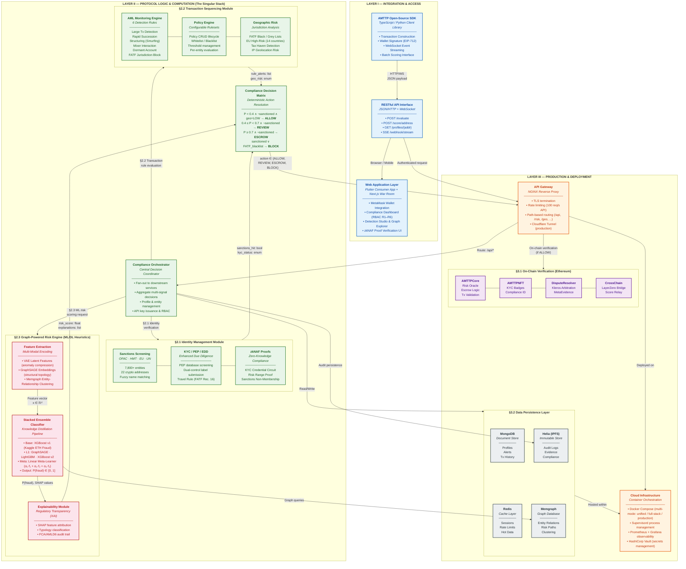

# AMTTP Protocol — Three-Layer System Architecture

> **IEEE Technical White Paper Diagram**  
> Version 1.0 | February 2026  
> Anti-Money Laundering Transaction Trust Protocol (AMTTP)

---

## Architecture Overview

The AMTTP Protocol follows a three-layer architecture pattern. Transactions flow top-down from the Integration Layer through the Protocol Logic & Computation layer (The Singular Stack) to the Production & Deployment infrastructure.

### Layer Summary

| Layer | Purpose | Key Components |
|-------|---------|----------------|
| **I — Integration & Access** | External-facing interfaces | SDK, REST API, Web Apps (Flutter + Next.js) |
| **II — Protocol Logic (The Singular Stack)** | Compliance computation | Identity Mgmt, Tx Sequencing, Graph-Powered Risk Engine |
| **III — Production & Deployment** | Infrastructure & persistence | API Gateway, On-Chain Contracts, Databases, Cloud Hosting |

---

## Mermaid.js Diagram

---

## Transaction Flow Summary

1. **SDK → API Interface**: Client constructs a transaction via the AMTTP SDK (TypeScript/Python), signs with EIP-712, and submits via HTTP/WebSocket.
2. **API Gateway Routing**: The NGINX gateway terminates TLS, applies rate limiting, and routes to the Compliance Orchestrator.
3. **Parallel Module Evaluation**:
   - **§2.1 Identity Management**: Sanctions screening (OFAC/HMT/EU/UN), KYC/PEP verification, zkNAF zero-knowledge proofs.
   - **§2.2 Transaction Sequencing**: 6 AML detection rules, policy engine evaluation, geographic risk analysis.
   - **§2.3 Risk Engine**: Feature extraction (VAE + GraphSAGE) → Stacked Ensemble (XGBoost + LightGBM + GraphSAGE → Meta-Learner) → SHAP Explainability.
4. **Compliance Decision Matrix**: Deterministic resolution — P(fraud) thresholds and sanctions status map to {ALLOW, REVIEW, ESCROW, BLOCK}.
5. **On-Chain Verification**: Allowed transactions are recorded via Ethereum smart contracts (AMTTPCore, AMTTPNFT, DisputeResolver, CrossChain).
6. **Data Persistence**: All results persisted across MongoDB, Redis, Memgraph, and Helia/IPFS for audit compliance.

---

## Color Legend

| Color | Layer | Scope |
|-------|-------|-------|
| 🔵 Blue (`#E3F2FD`) | Integration & Access | SDK, API, Web Apps |
| 🟢 Green (`#E8F5E9`) | Protocol Logic | Orchestrator, Identity, Tx Sequencing, Decision Matrix |
| 🔴 Red (`#FCE4EC`) | Risk Engine | Feature Extraction, Ensemble Classifier, Explainability |
| 🟠 Orange (`#FFF3E0`) | Production | API Gateway, Cloud Infrastructure |
| 🟣 Purple (`#F3E5F5`) | On-Chain | Ethereum Smart Contracts |
| ⚪ Grey (`#ECEFF1`) | Data Layer | MongoDB, Redis, Memgraph, IPFS |

---

*Document generated for IEEE Technical White Paper submission — AMTTP Protocol v3.0*
