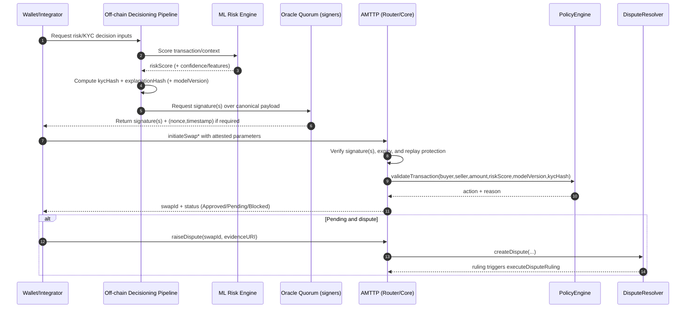

# AMTTP Protocol — Proposed Reference Architecture (protocol-centric)

This document focuses on the **underlying protocol**: on-chain contracts + off-chain oracle attestations + the SDK surface that ties them together. UI/gateway/microservice topology is treated as an *integration layer*, not the protocol.

The intent is to describe a reference architecture that:
- makes the **trust model explicit** (what must be trusted, what can be verified)
- defines the **attestation format** the chain enforces
- maps the **contract suite** into a coherent “protocol stack”
- clarifies where disputes, cross-chain sync, and policy logic live

---

## Protocol building blocks (as implemented)

### On-chain (Solidity)
- **Unified entrypoint**: `contracts/AMTTPRouter.sol`
  - Routes user operations across ETH/ERC20/NFT flows.
  - Today, its interface matches the **single-oracle signature** core (`bytes oracleSignature`).

- **Core swap engine (v1 / single oracle)**: `contracts/AMTTPCore.sol`
  - Escrow + HTLC-style completion (`hashlock`/`preimage`) + timelocks.
  - Enforces oracle-attested risk inputs via `_verifyOracleSignature(...)`.
  - Replay protection: includes `address(this)` and `block.chainid` in the signed payload.
  - Optional hook: `zkNAFModule` for zero-knowledge compliance gating.

- **Core swap engine (v2 / multi-oracle + replay hardening)**: `contracts/AMTTPCoreSecure.sol`
  - Multi-oracle threshold verification (`oracleThreshold`, `MAX_ORACLES`).
  - Replay protection: `usedNonces[keccak256(user, nonce, chainId)]`.
  - Signature validity window: `SIGNATURE_VALIDITY = 5 minutes`.
  - Governance hardening: timelocked admin operations + upgrade-approver flow.
  - Circuit breaker: daily volume limiting.

- **Policy**: `contracts/AMTTPPolicyEngine.sol`
  - Converts inputs (risk score, kyc hash, model version, velocity limits, etc.) into actions:
    - `Approve`, `Review`, `Escrow`, `Block`.

- **Disputes**: `contracts/AMTTPDisputeResolver.sol`
  - Kleros-based dispute workflow.
  - Escrow + evidence submission + ruling execution via the core.

- **Cross-chain**: `contracts/AMTTPCrossChain.sol`
  - LayerZero message passing for risk/policy sync.
  - Trusted remotes + replay protection + rate limiting/pausing concepts.

- **L2 routing / batching**: `contracts/AMTTPRiskRouter.sol`
  - Threshold-based routing with quorum concepts and circuit breaking.

### Off-chain (oracle + evidence)
- **Machine learning risk engine (scoring primitive)**
  - The ML risk engine is part of the protocol’s *attestation supply chain*: it produces (or contributes to) the `riskScore` that is later signed by the oracle quorum and enforced on-chain.
  - In this repo it exists as a FastAPI scoring service (see `ml/`), and is typically called by the orchestration/decisioning layer before signatures are produced.
  - **Important protocol constraint**: the chain currently enforces the *signed `riskScore`* (plus other fields), not the ML model itself. The ML engine is therefore **replaceable** as long as it outputs the same signed fields.

- **Oracle signing (trust model / response signing)**: `backend/oracle-service/src/trust/oracle-signer.ts`
  - Produces signed responses (decision/risk/explanation hash).
  - Supports ECDSA + RSA modes (ECDSA is the relevant mode for EVM verification).

- **Oracle signing (PoC signers)**:
  - `backend/oracle-service/simple-signer.js` (local encrypted key)
  - `backend/oracle-service/hsm-signer.js` (AWS KMS/Vault patterns)

These PoC signers are close to what the on-chain contracts expect, but **the canonical format should be treated as “whatever the contract verifies”** (see below).

### Client-side protocol access
- **TypeScript SDK surface**: the repo exposes SDK code in `client-sdk/` and also in `packages/client-sdk/`.
  - The current `AMTTPRouter.sol` interface and `packages/client-sdk/` usage align with the **v1 core** signature style (single `bytes oracleSignature`).
  - The v2 core requires additional parameters (signature arrays + nonce + timestamp).

---

## The trust model (what the chain verifies)

### Core idea
AMTTP treats “compliance/risk decisioning” as an **oracle-attested input** to an on-chain escrow + settlement flow.

The chain does not need to trust the ML model, sanctions provider, or explainability engine directly.
It only needs to verify:
- **who signed** the attestation (oracle allowlist / threshold quorum)
- **what exactly was signed** (domain separation; chainId; contract address where applicable)
- **freshness / replay protection** (nonce and/or validity window)

---

## Canonical attestation payloads (observed in contracts)

### v1: single-oracle attestation (AMTTPCore)
`AMTTPCore.sol` verifies a signature over:

`keccak256(address(this), chainId, buyer, seller, amount, riskScore, kycHash)`

then `toEthSignedMessageHash()` (EIP-191) + `ECDSA.recover`.

Implications:
- Domain separation is strong: the signature is bound to **this contract instance** and chain.
- No explicit nonce/timestamp exists in the payload; replay is mitigated by domain separation but not per-transaction uniqueness.

### v2: threshold multi-oracle attestation (AMTTPCoreSecure)
`AMTTPCoreSecure.sol` verifies **multiple unique oracle signatures** over:

`inner = keccak256(buyer, seller, amount, riskScore, kycHash, nonce, timestamp, chainId)`

then EIP-191:

`messageHash = keccak256("\x19Ethereum Signed Message:\n32", inner)`

with additional enforcement:
- **Freshness**: `block.timestamp <= signatureTimestamp + SIGNATURE_VALIDITY`
- **Replay protection**: `usedNonces[keccak256(buyer, nonce, chainId)] == false`

Implications:
- The protocol can safely accept oracle attestations from a public mempool (nonce prevents replay).
- The payload is bound to a chain; however, unlike v1, it is **not** bound to a particular contract address.

---

## Reference protocol architecture (logical)

```mermaid
flowchart LR
  %% Trust boundaries
  subgraph U[Untrusted]
    W[Wallet / Integrator]
  end

  subgraph O[Oracle / Attestation Plane]
    ML[ML Risk Engine\n(score + confidence + features)]
    GR[Graph Engine\n(exposure + proximity)]
    RU[Rules Engine\n(deterministic triggers)]
    D[Decisioning / Aggregation\n(ML + Graph + Rules)]
    S1[Oracle Signer 1]
    S2[Oracle Signer 2]
    S3[Oracle Signer 3]
    EV[Evidence / Explanation\n(hash or IPFS CID)]
  end

  subgraph C[On-chain AMTTP]
    R[AMTTPRouter]
    CORE1[AMTTPCore\n(v1 single-oracle)]
    CORE2[AMTTPCoreSecure\n(v2 threshold-oracle)]
    PE[AMTTPPolicyEngine]
    DR[AMTTPDisputeResolver\n(Kleros)]
    CC[AMTTPCrossChain\n(LayerZero)]
  end

  W -->|request attestation inputs| D
  D -->|score request| ML
  D -->|analyze exposure| GR
  D -->|evaluate rules| RU
  ML -->|riskScore (+ optional confidence)| D
  GR -->|graph signals| D
  RU -->|rule triggers| D

  D --> EV
  D --> S1
  D --> S2
  D --> S3

  %% Attestation is produced off-chain and verified on-chain
  S1 -->|signature(s)| W
  S2 -->|signature(s)| W
  S3 -->|signature(s)| W

  W -->|initiateSwap(..., riskScore, kycHash, oracle proof)| R
  R --> CORE1
  R -.optional/next.-> CORE2

  CORE1 -->|validateTransaction| PE
  CORE2 -->|validateTransaction| PE
  CORE1 --> DR
  CORE2 --> DR
  CORE1 --> CC
  CORE2 --> CC
```

---

## End-to-end protocol flow (reference)



---

## Reference standardization choices (what I’d converge on)

1) **Pick one canonical on-chain verification scheme**
- If you want stronger replay protection + decentralization: converge on `AMTTPCoreSecure.sol` (threshold, nonce, expiry).
- If you want simplest integration: keep `AMTTPCore.sol` but consider adding nonce/timestamp or per-swap binding.

2) **Make the SDK match the canonical scheme**
- v1 needs: `oracleSignature` bound to (contract, chain, tx tuple).
- v2 needs: `oracleSignatures[]`, `nonce`, `signatureTimestamp`, and a deterministic packing spec.

3) **Make ML model/versioning explicit across off-chain and on-chain**
- On-chain policy validation already accepts a `modelVersion` string (and the core tracks an `activeModelVersion`).
- Off-chain decisioning should treat `modelVersion` as part of the audit trail and (ideally) bind it cryptographically to the attestation (see note below).

Note (protocol hardening idea): today, the enforced signature payloads do not include `modelVersion` or `explanationHash`. If you want end-to-end auditability that is *cryptographically bound* to the on-chain decision, extend the signed payload to include at least `modelVersion` and an `explanationHash`/evidence reference in the next contract iteration.

4) **Treat explanation/evidence as append-only**
- On-chain you store `explanationHash`/`evidenceURI` references (or emit events).
- Off-chain you store full explanations (IPFS/Helia, object store, SIEM).

5) **Explicitly define “oracle quorum governance”**
- Who can add/remove oracles, and under what delay.
- `AMTTPCoreSecure.sol` already introduces timelock and upgrade-approvers; make it the standard.

---

## Non-goals (for this document)
- UI composition, gateway routing, and microservice deployment patterns.
- Operational concerns like CORS/env config (important, but not protocol architecture).

