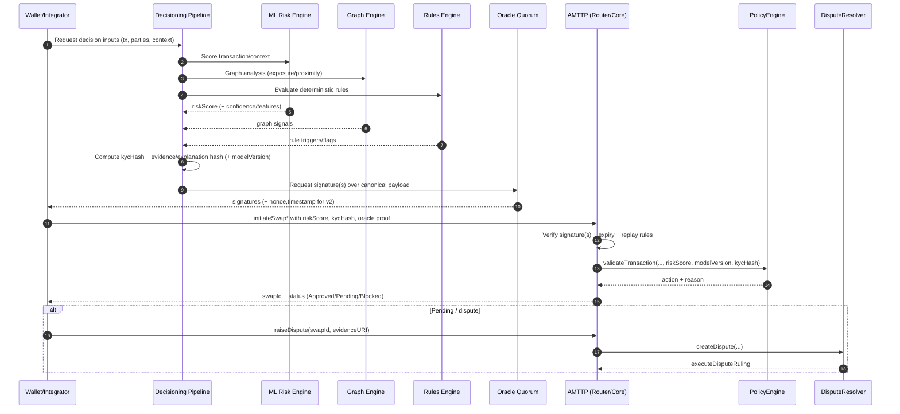

# AMTTP Protocol — Write-up (protocol-centric)

AMTTP (Anti‑Money Laundering Transaction Trust Protocol) is a hybrid on-chain/off-chain protocol that makes compliance and risk decisions **enforceable at transaction execution time**.

The key idea is simple:
- Off-chain systems (including the **ML risk engine**) compute risk and generate an **oracle attestation**.
- On-chain contracts verify the attestation (who signed, what was signed, freshness/replay rules).
- A policy layer converts the attested inputs into an action: **Approve / Review / Escrow / Block**.

This document describes the underlying protocol and its trust model. It intentionally does *not* describe the UI/gateway stack.

---

## What AMTTP enforces on-chain

AMTTP’s on-chain layer is designed to enforce **outcomes**, not “trust” ML models directly.

The chain enforces:
- **Authorization**: only allowlisted oracle(s) can attest (or a quorum of them).
- **Domain separation**: signatures are bound to a chain (and in some variants also to a specific contract instance).
- **Freshness / replay protection**: signatures expire and/or nonces cannot be reused.
- **Deterministic policy actions**: policy evaluation yields a canonical action that maps to escrow/approval/blocking behavior.

---

## Protocol roles (actors)

- **Wallet / Integrator**: initiates protocol operations (swap/escrow) and provides oracle proofs.
- **Decisioning pipeline (off-chain)**: aggregates three primary primitives — **ML + Graph + Rules** — and produces a canonical decision payload for oracle signing.
- **ML risk engine**: produces a numeric risk score (and optionally confidence/features).
- **Graph engine**: derives network/context risk from transaction graph structure (proximity, clustering, exposure).
- **Rules engine**: applies deterministic policy/rule triggers to produce flags and action constraints.
- **Oracle signer(s)**: sign the canonical payload that the chain verifies.
- **On-chain AMTTP contracts**: verify attestations, apply policy, run escrow/settlement, and handle disputes.

---

## Architecture (protocol-level)

```mermaid
flowchart LR
  subgraph U[Untrusted]
    W[Wallet / Integrator]
  end

  subgraph O[Oracle / Attestation Plane]
    ML[ML Risk Engine\n(score + confidence + features)]
    GR[Graph Engine\n(network exposure + proximity)]
    RU[Rules Engine\n(deterministic triggers)]
    AGG[Decisioning / Aggregation\n(ML + Graph + Rules)]
    EV[Evidence / Explanation\n(hash or IPFS CID)]
    S1[Oracle Signer 1]
    S2[Oracle Signer 2]
    S3[Oracle Signer 3]
  end

  subgraph C[On-chain AMTTP]
    R[AMTTPRouter\n(unified entrypoint)]
    CORE1[AMTTPCore\n(v1: single-oracle)]
    CORE2[AMTTPCoreSecure\n(v2: threshold-oracle)]
    PE[AMTTPPolicyEngine\n(actions)]
    DR[AMTTPDisputeResolver\n(Kleros)]
    CC[AMTTPCrossChain\n(LayerZero)]
  end

  W -->|request attestation inputs| AGG
  AGG -->|score request| ML
  AGG -->|analyze exposure| GR
  AGG -->|evaluate rules| RU

  ML -->|riskScore (+ optional confidence)| AGG
  GR -->|graph signals| AGG
  RU -->|rule triggers| AGG

  AGG --> EV
  AGG -->|sign canonical payload| S1
  AGG -->|sign canonical payload| S2
  AGG -->|sign canonical payload| S3

  S1 -->|signature(s)| W
  S2 -->|signature(s)| W
  S3 -->|signature(s)| W

  W -->|initiateSwap* + oracle proof| R
  R --> CORE1
  R -.optional/next.-> CORE2

  CORE1 --> PE
  CORE2 --> PE
  CORE1 --> DR
  CORE2 --> DR
  CORE1 --> CC
  CORE2 --> CC
```

---

## On-chain contract stack (how the protocol is composed)

AMTTP’s protocol contracts are modular. The main pieces in this repo are:

- **Unified router**: `contracts/AMTTPRouter.sol`
  - The “one entrypoint” pattern for users/integrators.

- **Core escrow + settlement**:
  - `contracts/AMTTPCore.sol` (v1)
    - Single oracle signature verification.
    - Domain-separated by `address(this)` and `block.chainid`.
  - `contracts/AMTTPCoreSecure.sol` (v2)
    - Multi-oracle threshold verification.
    - Enforces signature expiry (`SIGNATURE_VALIDITY`) and replay protection via `usedNonces`.

- **Policy**: `contracts/AMTTPPolicyEngine.sol`
  - Maps inputs (risk score, KYC hash, model version, velocity limits, etc.) to actions:
    - Approve / Review / Escrow / Block.

- **Disputes**: `contracts/AMTTPDisputeResolver.sol`
  - Kleros-based dispute workflow, wired into the core.

- **Cross-chain**: `contracts/AMTTPCrossChain.sol`
  - LayerZero-based propagation of risk/policy state.

- **Risk routing / batching**: `contracts/AMTTPRiskRouter.sol`
  - Optimizations for L2-style routing/quorum concepts.

---

## Oracle attestations: what is signed (and why it matters)

AMTTP’s security comes from verifying that **the right oracle(s)** signed **the right payload**, and that the payload is fresh.

### v1 attestation (AMTTPCore)
`AMTTPCore.sol` verifies a signature over a payload including:
- `address(this)`
- `chainId`
- `buyer`, `seller`, `amount`
- `riskScore`
- `kycHash`

This binds the attestation to a specific deployed contract instance and chain.

### v2 attestation (AMTTPCoreSecure)
`AMTTPCoreSecure.sol` verifies a threshold of unique oracle signatures over:
- `buyer`, `seller`, `amount`
- `riskScore`, `kycHash`
- `nonce`, `timestamp`
- `chainId`

And enforces:
- **expiry** (timestamp + validity window)
- **replay protection** (nonce hash cannot be reused)

This is stronger for public submission channels and multi-oracle decentralization.

---

## End-to-end protocol flow (from scoring to enforcement)



---

## How the ML risk engine fits the protocol

The off-chain decisioning plane is explicitly **ML + Graph + Rules**:

- The **ML risk engine** is the protocol’s statistical scoring primitive and drives the numeric `riskScore` that is signed and enforced on-chain.
- The **graph engine** contributes contextual risk signals (network exposure/proximity) that influence the final decision and explanation.
- The **rules engine** provides deterministic triggers/constraints (for example: hard blocks, velocity flags, escalation triggers).

Practically:
- The chain enforces the *attested output fields* (e.g., `riskScore`, `kycHash`, nonce/timestamp where applicable).
- ML/graph/rules can evolve independently as long as the signed payload specification remains stable (or versioned).

Important boundary:
- The chain does **not** verify ML/graph/rule internals.
- The chain verifies the **signed output fields**.

This means you can upgrade/replace models without changing the protocol, as long as you:
- keep the attested fields stable, and
- keep oracle signing/verifying rules stable (or explicitly version them).

---

## SDK integration (protocol surface)

AMTTP includes TypeScript SDK code (see `client-sdk/` and `packages/client-sdk/`) intended to:
- prepare the on-chain call inputs
- fetch/receive oracle attestations
- submit protocol transactions

Protocol note:
- The router/core interface used by the SDK must match the chosen verification scheme (v1 vs v2). If you standardize on v2, the SDK must supply `oracleSignatures[]`, `nonce`, and `signatureTimestamp`.

---

## Recommended convergence (one protocol, one scheme)

To keep the protocol crisp for integrators, converge on:

1) **One canonical core verification scheme**
- Prefer v2 (`AMTTPCoreSecure`) for quorum + expiry + replay protection.

2) **One canonical signed payload spec**
- Publish a single packing spec and version it.
- Consider binding to `verifyingContract` (contract address) in v2 as well.

3) **Auditability bound to enforcement (optional hardening)**
- Today, the enforced signature payloads do not bind `modelVersion` or `explanationHash`.
- If you want cryptographic linkage between “why” and “what was enforced”, extend the signed payload to include `modelVersion` and an `explanationHash`/evidence reference.

---

## Appendix

- Deeper protocol architecture details and diagrams: see `documentation/AMTTP_PROPOSED_REFERENCE_ARCHITECTURE.md`.
